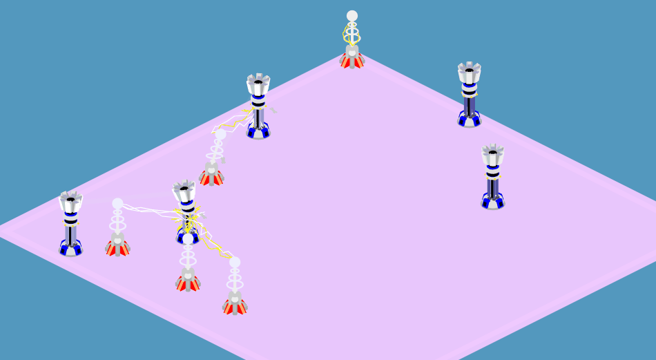
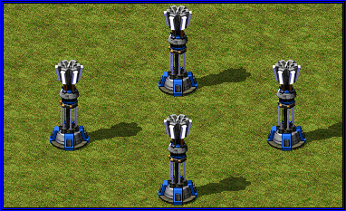
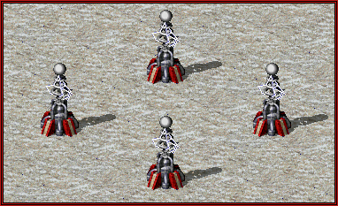
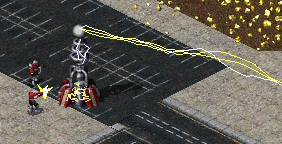

# 红色警戒2 光棱塔 VS 磁暴线圈
## 预览
[在线游玩](https://zzj1804.github.io/ra2-tower-war/game/)

[在 codepen 上游玩](https://codepen.io/zzjcodepen/pen/OJMggjB)

## 操作方法
打开 game/indexl.html 游玩
### 鼠标
按住鼠标拖动画面可移动画布

转动鼠标滚轮使画布放大缩小
### 按钮
按下两个 build 按钮进入两种塔的建造模式，然后鼠标移到地图上点击对应格子进行建造，再点击按钮取消建造模式；

sell 按钮进入卖塔模式，点击塔进行卖出，再点击按钮取消建造模式；

center 按钮点击后视角会复位；

pause/play 按钮可暂停或使游戏继续进行（暂停中也可以 build！）；

1X/2X/0.5X 按钮用于调节游戏速度。
### 快捷键
↑↓←→：移动地图

r：变更拖动效果为平移或旋转

q：光棱塔建造模式

w：磁暴线圈建造模式

e：sell 模式

s：开关 stats

c：center 视角复位

p: 开关画中画
### dat.gui
#### illo 画布
zoom 画布缩放

stats 帧数

isDragRotate 拖拽模式
#### TeslaCoil 磁暴线圈
AP 攻击力

ATTACK_CD 攻击间隔

ATTACK_RANGE 攻击范围

MAX_HP 最大生命值

AUTO_REPAIR_VAL 每0.1秒自动维修回复的生命值
#### PrismTower 光棱塔
MAX_RECEIVE_LASER_NUM 最大接受递光数

PER_RECEIVE_LASER_AP_AMPLIFICATION 每接受一束光后的攻击增幅
## 技术栈

Zdog
gsap

塔稍微多一点画面就很卡顿了，也许是我的技术不过关，但是我觉得 Zdog 还是比较适合做些小工艺品 ：）
## 灵感来源
灵感来源是这个视频：[【心灵终结3.34】Ai混战第二期：4大t2防御塔比拼](https://www.bilibili.com/video/BV1Qt411X7DL)

强烈推荐心灵终结这款红警2 MOD

## Demo
demo里是我在制作过程中的实验产物，有些代码不完整，有些最终没用上

## TODO
解决添加 Smoke 会出现透视 bug 的问题

添加音效
